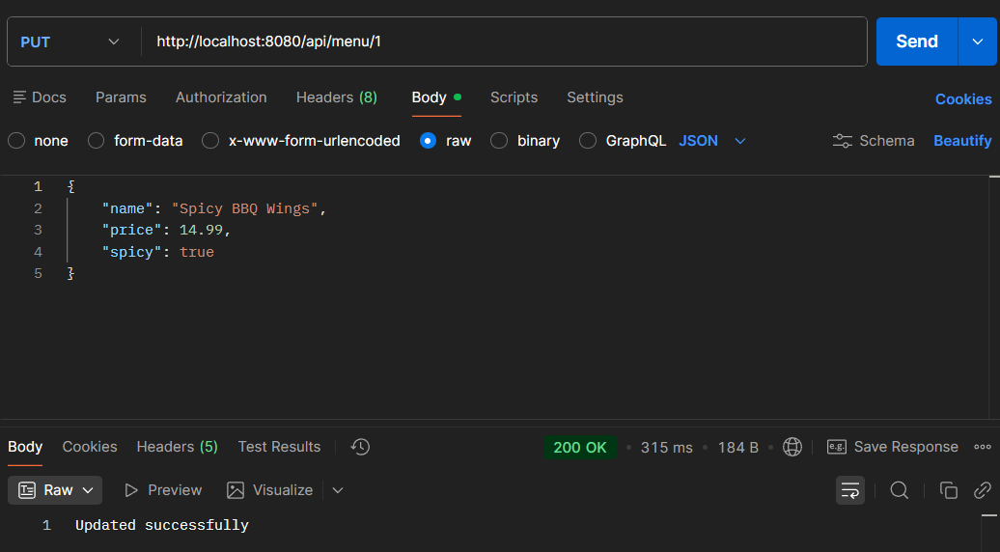
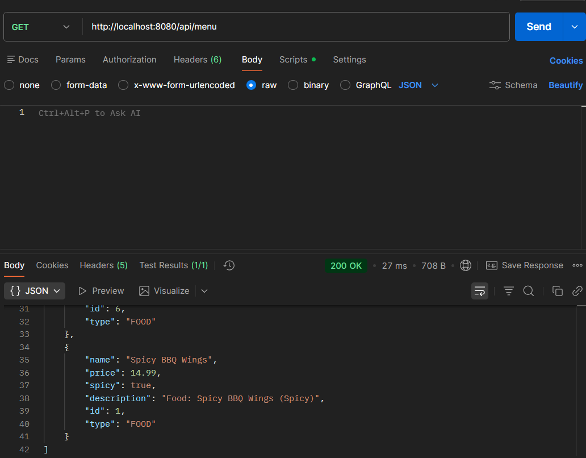
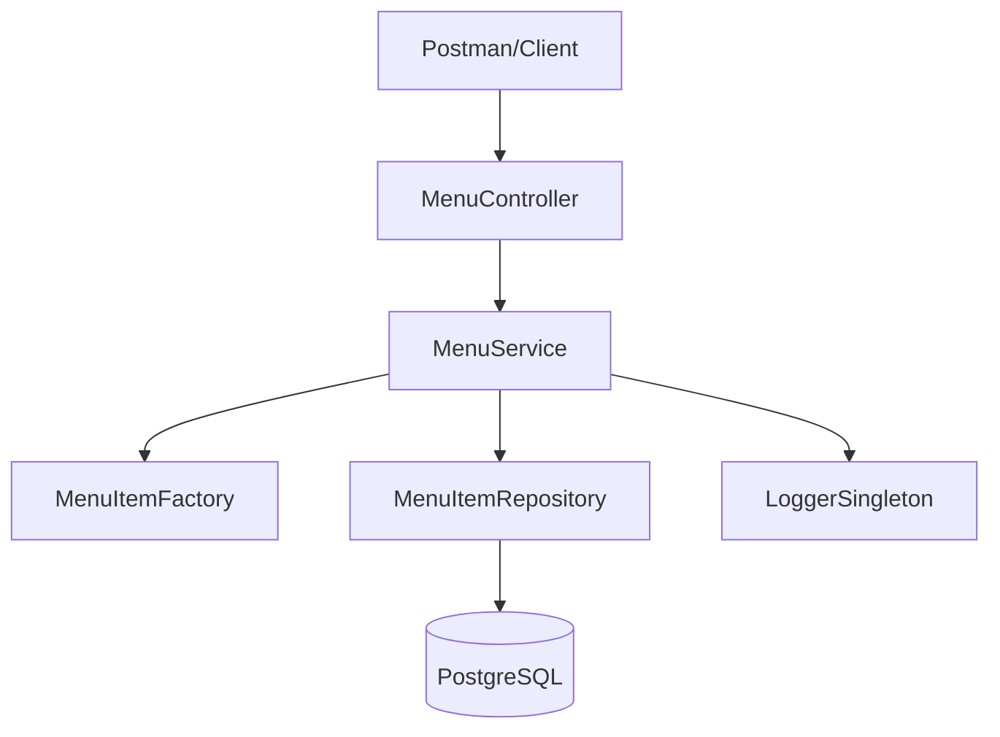
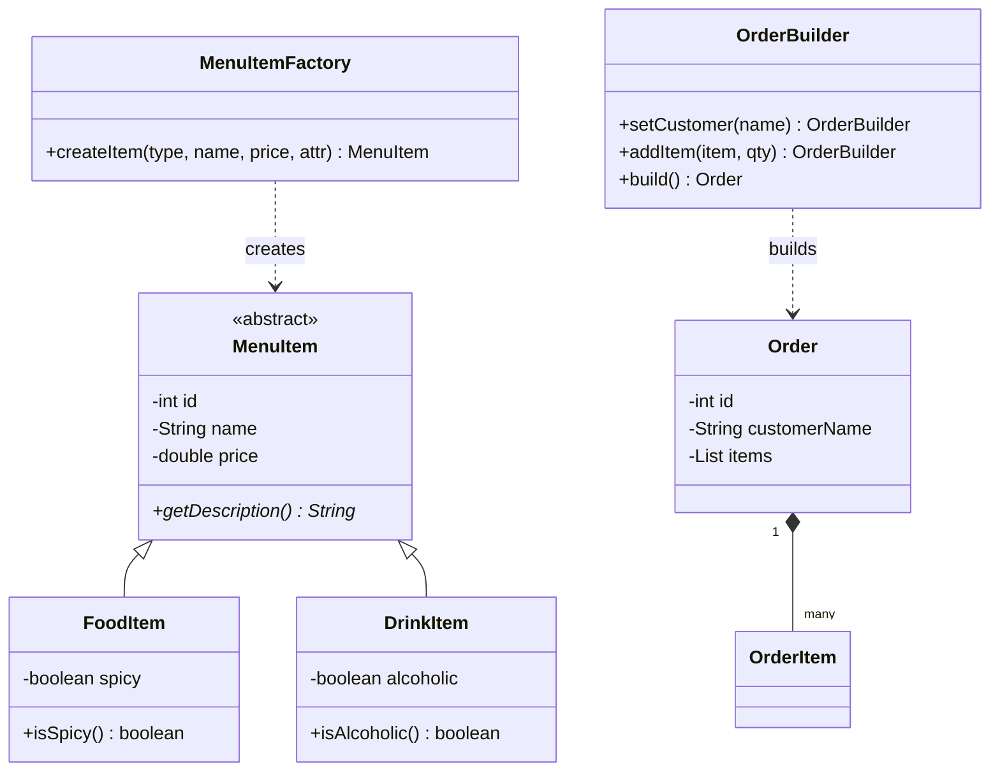

# Endterm Project

## A. Project Overview
This project is a high-performance RESTful API developed with Spring Boot for restaurant menu management and customer ordering. It serves as a comprehensive demonstration of advanced Java backend architecture, integrating modern design patterns, relational database management via JDBC, and strict adherence to SOLID principles.

**Key Entities:**
* **MenuItem (Abstract):** The foundation for the polymorphic menu.
* **FoodItem & DrinkItem:** Specialized menu entities with unique logic.
* **Order:** A complex entity managing customer interactions and item composition.

## B. REST API Documentation
The system exposes a standardized REST interface for all CRUD operations.

### Endpoint List
| Method | Endpoint | Description | Request Body |
| :--- | :--- | :--- | :--- |
| **POST** | `/api/menu/create` | **Factory Pattern** creation | Query Params (`type`, `name`, etc.) |
| **GET** | `/api/menu` | Fetch all items (Polymorphic) | None |
| **GET** | `/api/menu/inspect` | **Reflection API** analysis | None |
| **PUT** | `/api/menu/{id}` | Update item by ID | JSON (MenuItem) |
| **DELETE** | `/api/menu/{id}` | Remove item by ID | None |

### Sample JSON Request (PUT Update)
```json
[{
    "name": "Spicy BBQ Wings",
    "price": 14.99,
    "spicy": true
}]
```
### Sample JSON Response (GET List)
```
[{
        "id": 1,
        "name": "Spicy BBQ Wings",
        "price": 14.99,
        "description": "Food: Spicy BBQ Wings (Spicy)",
        "spicy": true,
        "type": "FOOD"
}]
```


## C. Design Patterns Section
To meet the academic requirements of the Endterm project, the following patterns were implemented manually:

1.  **Singleton Pattern (`LoggerSingleton`)**
    * **Purpose:** Ensures a single shared logging instance throughout the application lifecycle.
    * **Usage:** Injected into `MenuService` to track database operations (Create, Update, Delete). It prevents redundant resource allocation and provides a synchronized log in the system console.

2.  **Factory Pattern (`MenuItemFactory`)**
    * **Purpose:** Decouples the client (Controller) from concrete class instantiation.
    * **Usage:** Used in the `/api/menu/create` endpoint. It dynamically creates either a `FoodItem` or a `DrinkItem` based on the `type` parameter, making the system easily extensible for new item types.

3.  **Builder Pattern (`Order.Builder`)**
    * **Purpose:** Provides a flexible solution for constructing complex `Order` objects.
    * **Usage:** Implemented as a static inner class within `Order`. It allows for step-by-step assembly of an order (adding items, setting customer name) before final validation and instantiation.

## D. Component Principles Section
The project structure reflects professional component-based design:
* **REP (Reuse/Release Equivalence Principle):** Core modules like the Repository and Service are developed as independent units, ready for reuse in other parts of the system.
* **CCP (Common Closure Principle):** Classes that are functionally related, such as `Order` and its `Builder`, are kept in the same package to ensure that changes affect only one component.
* **CRP (Common Reuse Principle):** The package layout ensures that the API layer doesn't depend on classes it doesn't actually use, maintaining a clean dependency tree.

## E. SOLID & OOP Summary
* **S (Single Responsibility):** Each layer has a dedicated role: `MenuController` handles HTTP routing, `MenuService` manages business logic, and `MenuItemRepository` handles JDBC.
* **O (Open/Closed):** The system is open for extension (new menu types) but closed for modification in the service layer thanks to the Factory pattern.
* **L (Liskov Substitution):** Subclasses like `FoodItem` and `DrinkItem` can be used anywhere a `MenuItem` is expected without breaking the system.
* **I (Interface Segregation):** The `CrudRepository<T>` interface provides a focused set of methods without forcing implementations to handle unnecessary logic.
* **D (Dependency Inversion):** High-level services depend on abstractions (`CrudRepository`), not on low-level JDBC implementations.

**Advanced OOP Features:**
* **Reflection (RTTI):** Implemented via `ReflectionUtil` to inspect `MenuService` structure at runtime.
* **Lambdas:** Utilized for efficient list processing and sorting within the Service layer.

## F. Database Schema

The system uses a PostgreSQL relational database:
* **Table `menu_items`:** Uses a discriminator column (`item_type`) to support single-table inheritance for Food and Drinks.
* **Table `orders` & `order_items`:** Implements a **Composition** relationship with Foreign Key constraints and cascading deletes.

## G. System Architecture Diagram


### Application Flow

### UML Class Diagram

## H. Instructions to Run
1. **Database Setup:** Create a PostgreSQL database named restaurant_db.
2. **Configuration:** Update the src/main/resources/application.properties file with your database username and password.
3. **Build & Run:** Open the project in your IDE (IntelliJ IDEA recommended) and run RestaurantApplication.java.
4. **Test:** Use Postman to send requests to http://localhost:8080/api/menu.
## I. Reflection Section
This project served as a bridge between theoretical OOP concepts and practical enterprise development. Implementing Spring Boot REST endpoints taught me the importance of clear API contracts. Manually coding Design Patterns (Factory, Builder, Singleton) provided deep insight into object lifecycle management, while adhering to SOLID principles ensured the code remains maintainable and scalable.
